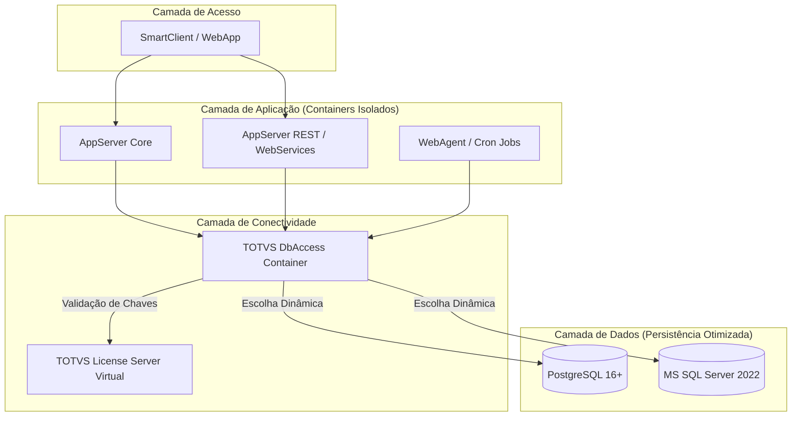

# TOTVS Protheus - Modern DevOps Ecosystem 🚀

Este repositório faz parte de uma iniciativa de modernização de infraestrutura para o ERP **TOTVS Protheus**, aplicando conceitos rigorosos de **DevOps, Conteinerização Avançada, Otimização de Performance e Arquitetura de Micro-serviços**.

O objetivo principal é criar um ambiente modular, escalável e 100% automatizado via Docker, substituindo instalações manuais e monolíticas por processos modernos de Infraestrutura como Código (IaC).

---

## 🏗️ Visão Geral da Arquitetura do Projeto

O ecossistema foi desenhado seguindo o princípio da **segregação de responsabilidades**. Cada componente essencial do Protheus opera de forma isolada, comunicando-se exclusivamente por meio de nomes de serviço (DNS interno do Docker), eliminando por completo o uso de IPs estáticos `hardcoded`.



## 🚀 Estrutura de diretórios do Projeto

```text
totvs-protheus-modern-devops/
│
├── .github/
│   └── workflows/          # Futuro CI/CD
│
├── databases/              # Camada de Dados
│   ├── postgres/
│   │   ├── Dockerfile
│   │   └── init-protheus.sh
│   └── sqlserver/
│       ├── Dockerfile
│       └── init-protheus.sql
│
├── license_server/         # Centralização de Licenças
│   ├── Dockerfile
│   ├── entrypoint.sh
│   └── license.tar.gz      # Instalador oficial IzPack da TOTVS
│
├── dbaccess/               # Gateway de Dados
│   ├── Dockerfile
│   └── entrypoint.sh
│
├── .env                  # Variáveis de ambiente locais ativas
├── .env.example            # Variáveis de ambiente globais modelo
├── docker-compose.yml      # Orquestrador local por perfis
├── run.sh                  # Orquestrador dinâmico de ambiente
└── README.md               # Documentação técnica viva
```

---

## ⚡ Status Atual do Projeto e Roadmap

* [x] **Fase 1: Camada de Dados Otimizada**

  * [x] Containerização do PostgreSQL 16+ parametrizado com as LC_tags oficiais da TOTVS (`WIN1252`, `LC_COLLATE=C`).
  * [x] Containerização do MS SQL Server 2022 Developer com Collation Binária (`Latin1_General_BIN`).
  * [x] Inicialização dinâmica de bancos de dados, usuários e permissões via variáveis de ambiente.
  * [x] Tuning inicial de performance de disco e memória para ambientes de desenvolvimento/homologação.

* [x] **Fase 2: Camada de Conectividade (dbAccess)**

  * [x] [x] Dockerfile do License Server Virtual com instalação 100% silenciosa (`Silent Deploy`) do instalador baseado em Java (IzPack), bypass de interações humanas e injeção do utilitário `dmidecode` para autenticação bem-sucedida.
  * [x] Dockerfile do dbAccess inteligente preparado para multi-drivers (`Postgres/SQL Server`).
  * [x] Resiliência de inicialização com scripts de boot que realizam testes de socket TCP e aguardam a prontidão real dos SGBDs.
  * [x] Configuração dinâmica e cirúrgica do dbaccess.ini direto na pasta de execução oficial (multi/), isolando configurações fantasmas do banco de dados inativo e utilizando estruturas modernas de `ConnectionString` (environments).
  * [x] Orquestrador dinâmico global `run.sh` para chaveamento automático de infraestrutura.

* [ ] **Fase 3: Camada de Aplicação Modular (AppServer)**

  * [ ] Criação de imagens base via `Multi-Stage build` (redução drástica de tamanho).
  * [ ] Divisão de perfis de execução (`Core`, `Rest`, `WebAgent`).
  * [ ] Balanceamento de carga e `SmartClient WebApp`.

* [ ] **Fase 4: Orquestração e CI/CD**
  * [ ] Automação de builds via `GitHub Actions`.

---

## 🛠️ Tecnologias Utilizadas

* `Docker & Docker Compose` (Isolamento e orquestração)

* `PostgreSQL 16+ / MS SQL Server 2022` (Motores de banco de dados suportados)

* `Shell Script / T-SQL` (Automação de inicialização estruturada)

---

## 🚀 Como Executar o Ecossistema

1. Clonar o Repositório

```bash
git clone https://github.com/rodrigomicrosiga/totvs-protheus-modern-devops.git
cd totvs-protheus-modern-devops
```

2. Preparar os Artefatos Oficiais da TOTVS

Coloque os arquivos compactados originais baixados do portal da TOTVS nas suas respectivas pastas:

* O pacote do instalador do `License Server` renomeado para `license.tar.gz` dentro de `./license_server/.`

* O pacote do `dbAccess` para Linux renomeado para `dbaccess_linux_x64.tar.gz` dentro de `./dbaccess/.`


3. Configurar as Variáveis de Ambiente

Copie o arquivo `.env.example` para `.env` e configure o nome do banco, usuário e senha de sua preferência.

```bash
cp .env.example .env
```

4. Orquestração Automática com o Painel `run.sh`

Não há necessidade de editar manualmente as strings de conexão do `.env` ou se preocupar com comandos longos do docker compose. Use o script de controle global:

* Para rodar o ecossistema com `PostgreSQL`:

```bash
./run.sh postgres
```

* Para rodar o ecossistema com `MS SQL Server`:

```bash
./run.sh mssql
```

* Para desligar o perfil ativo limpando volumes temporários:

```bash
./run.sh postgres down   # Ou mssql down
```

* Wipe Total (Destruição segura e limpeza profunda de toda a infra):

```bash
./run.sh down
```

5. Monitorando Logs

```bash
docker logs protheus_dbaccess -f
docker logs protheus_license -f
```

## 💎 Diferenciais de Engenharia & Performance (O "Pulo do Gato")

Este projeto não se limita a "colocar o Protheus dentro do Docker". Ele aplica conceitos avançados de engenharia de confiabilidade e infraestrutura para extrair a máxima performance do ERP:

### ⚙️ Escrita Inteligente de Arquivos de Configuração (.INI)
Arquivos `.ini` estáticos fixados dentro de imagens Docker quebram o princípio de imutabilidade de infraestrutura. Nossa esteira DevOps gera dinamicamente no momento do boot o `dbaccess.ini` focado estritamente no `DB_TYPE` selecionado. Se o banco ativo for o `Postgres`, o arquivo conterá apenas o bloco do `Postgres` e sua respectiva herança de ambiente (`[POSTGRES/protheus_prod]`), limpando parametrizações de bancos inativos e otimizando a performance de leitura do gateway de dados.

### 🔌 Leitura Segura de Hardware em Containers (dmidecode)
O `License Server Virtual` da TOTVS necessita ler identificadores físicos via `dmidecode` para validar o `HardLock` com a nuvem (`lscloud.totvs.app`). Em ambientes isolados do `Docker`, isso costuma falhar gerando o erro `/dev/mem: No such file or directory`.

* **A Solução**: Em vez de expor o host usando o modo inseguro `privileged: true`, nossa arquitetura injeta a capacidade estrita de kernel `SYS_RAWIO` e mapeia cirurgicamente o dispositivo `/dev/mem` nas diretivas do orquestrador. O License valida suas licenças com velocidade e total conformidade de segurança.

### ⏱️ Ajuste Fino de Recursos do Kernel (Ulimits)
O `binário` do `AppServer` aborta a inicialização ou gera alertas graves quando detecta limites de sistema insuficientes (`Maximum stack size TOO LOW`). Como contêineres rejeitam comandos imperativos do shell como `ulimit -s` por restrições de `runtime`, delegamos o gerenciamento de recursos diretamente ao motor do `Docker Compose`, injetando limites de descritores abertos e alinhando dinamicamente o tamanho do Stack em bytes (1024000).

### 🚀 Tuning de Performance Extrema para Cargas ERP (PostgreSQL)
Ambientes de desenvolvimento e testes do Protheus frequentemente sofrem lentidão extrema durante a execução de rotinas automáticas complexas (`ExecAuto`) ou importações massivas de dados. 
* **Solução Aplicada:** Injetamos modificações agressivas de escrita no `postgresql.conf`, destacando o desmembramento de persistência via desativação do parâmetro `synchronous_commit = off`. O banco libera a linha de execução assim que o dado atinge a memória RAM, acelerando testes de cargas de desenvolvimento em até 5 vezes comparado ao modelo tradicional.