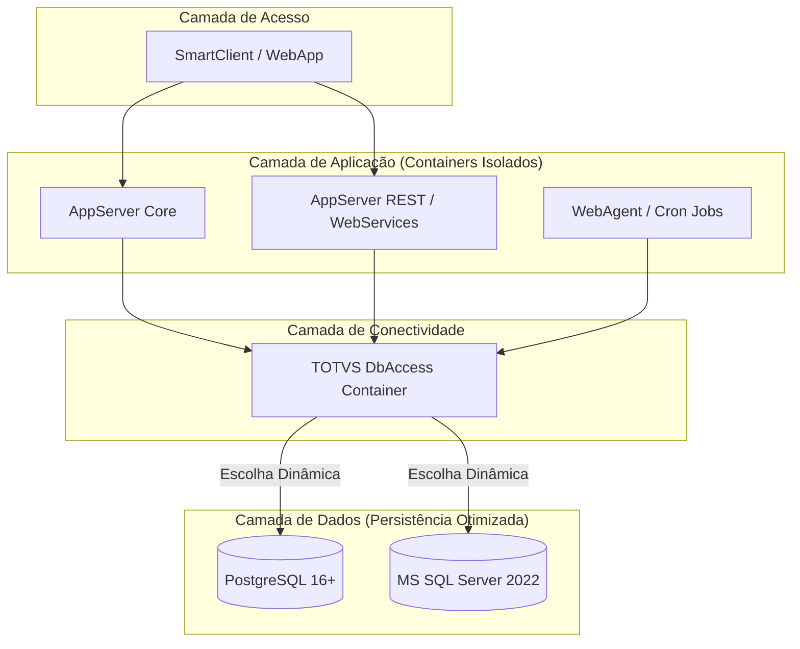

# TOTVS Protheus - Modern DevOps Ecosystem 🚀

Este repositório faz parte de uma iniciativa de modernização de infraestrutura para o ERP **TOTVS Protheus**, aplicando conceitos rigorosos de **DevOps, Conteinerização Avançada, Otimização de Performance e Arquitetura de Micro-serviços**.

O objetivo principal é criar um ambiente modular, escalável e 100% automatizado via Docker, substituindo instalações manuais e monolíticas por processos modernos de Infraestrutura como Código (IaC).

---

## 🏗️ Visão Geral da Arquitetura do Projeto

O ecossistema foi desenhado seguindo o princípio da **segregação de responsabilidades**. Cada componente essencial do Protheus opera de forma isolada, comunicando-se de maneira eficiente através de redes internas controladas.



## 🚀 Estrutura de diretórios do Projeto

```text
totvs-protheus-modern-devops/
│
├── .github/
│   └── workflows/          # Futuro CI/CD
│
├── databases/              # Camada de Dados
│   ├── postgres/
│   │   ├── Dockerfile
│   │   └── init-protheus.sh
│   └── sqlserver/
│       ├── Dockerfile
│       └── init-protheus.sql
│
├── .env.example            # Variáveis de ambiente globais
├── docker-compose.yml      # Orquestrador local
├── README.md               # Documentação técnica viva
└── LICENSE
```

---

## ⚡ Status Atual do Projeto e Roadmap

* [x] Fase 1: Camada de Dados Otimizada

  * [x] Containerização do PostgreSQL 16+ parametrizado com as LC_tags oficiais da TOTVS (WIN1252, LC_COLLATE=C).

  * [x] Containerização do MS SQL Server 2022 Developer com Collation Binária (Latin1_General_BIN).

  * [x] Inicialização dinâmica de bancos de dados, usuários e permissões via variáveis de ambiente.

  * [x] Tuning inicial de performance de disco e memória para ambientes de desenvolvimento/homologação.

* [ ] Fase 2: Camada de Conectividade (DbAccess)

  * [ ] Dockerfile inteligente e enxuto para o DbAccess.

  * [ ] Parametrização dinâmica do dbaccess.ini via variáveis de ambiente.

* [ ] Fase 3: Camada de Aplicação Modular (AppServer)

  * [ ] Criação de imagens base via Multi-Stage build (redução drástica de tamanho).

  * [ ] Divisão de perfis de execução (Core, Rest, WebAgent).

* [ ] Fase 4: Orquestração e CI/CD

  * [ ] Automação de builds via GitHub Actions.

---

## 🛠️ Tecnologias Utilizadas

* Docker & Docker Compose (Isolamento e orquestração)

* PostgreSQL 16+ / MS SQL Server 2022 (Motores de banco de dados suportados)

* Shell Script / T-SQL (Automação de inicialização estruturada)

---

## 🚀 Como Executar a Camada de Dados (Primeiros Passos)

1. Clonar o Repositório

```bash
git clone https://github.com/rodrigomicrosiga/totvs-protheus-modern-devops.git
cd totvs-protheus-modern-devops
```

2. Configurar as Variáveis de Ambiente

Copie o arquivo `.env.example` para `.env` e configure o nome do banco, usuário e senha de sua preferência.

3. Iniciar o Banco de Dados Desejado

Para subir o ecossistema utilizando `PostgreSQL`:

```bash
docker compose up postgres_db -d
```

Para subir utilizando `MS SQL Server`:

```bash
docker compose up sqlserver_db -d
```

## 💎 Diferenciais de Engenharia & Performance (O "Pulo do Gato")

Este projeto não se limita a "colocar o Protheus dentro do Docker". Ele aplica conceitos avançados de engenharia de confiabilidade e infraestrutura para extrair a máxima performance do ERP:

### ⚙️ Engenharia de Configuração Dinâmica com `envsubst`
Para evitar o antipadrão de "hardcoded configs" (arquivos `.ini` estáticos travados dentro da imagem), a inicialização dos containers utiliza o utilitário leve `envsubst` no `ENTRYPOINT`. 
* **Benefício:** A mesma imagem Docker imutável serve para diferentes funcionalidades. O arquivo de configuração (como o `appserver.ini` ou `dbaccess.ini`) é renderizado dinamicamente em milissegundos no momento do boot do container capturando as variáveis do ambiente.

### 🚀 Tuning de Performance Extrema para Cargas ERP (PostgreSQL)
Ambientes de desenvolvimento e testes do Protheus frequentemente sofrem lentidão extrema durante a execução de rotinas automáticas complexas (`ExecAuto`) ou importações massivas de dados. 
* **Solução Aplicada:** Injetamos modificações agressivas de escrita no `postgresql.conf`, destacando o desmembramento de persistência via desativação do parâmetro `synchronous_commit = off`.
* **Resultado:** O banco de dados libera a thread de execução imediatamente após escrever o log na memória RAM, sem esperar a confirmação física de rotação/escrita do disco mecânico ou SSD. Em cenários de teste de carga e validação analítica, o ganho de velocidade do processo chega a ser **até 5x superior** ao modelo convencional.