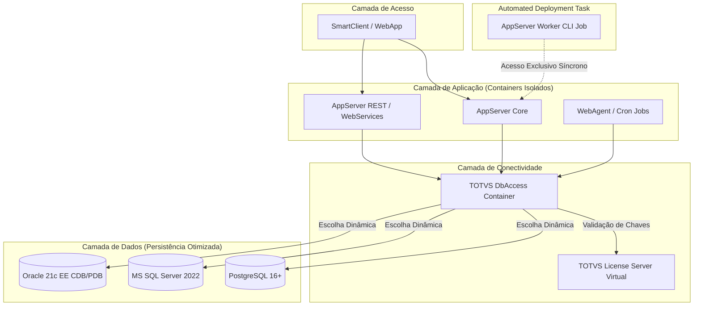

# TOTVS Protheus - Modern DevOps Ecosystem 🚀

Este repositório faz parte de uma iniciativa de modernização de infraestrutura para o ERP **TOTVS Protheus**, aplicando conceitos rigorosos de **DevOps, Conteinerização Avançada, Otimização de Performance e Arquitetura de Micro-serviços**.

O objetivo principal é criar um ambiente modular, escalável e 100% automatizado via Docker, substituindo instalações manuais e monolíticas por processos modernos de Infraestrutura como Código (IaC).

---

## 🏗️ Visão Geral da Arquitetura do Projeto

O ecossistema foi desenhado seguindo o princípio da **segregação de responsabilidades**. Cada componente essencial do Protheus opera de forma isolada, comunicando-se exclusivamente por meio de nomes de serviço (DNS interno do Docker), eliminando por completo o uso de IPs estáticos `hardcoded`.



## 🚀 Estrutura de diretórios do Projeto

```text
totvs-protheus-modern-devops/
│
├── .github/
│   └── workflows/          # Futuro CI/CD
│
├── appserver/              # Camada de Aplicação (Core & Especialistas)
│   ├── Dockerfile
│   ├── entrypoint.sh       # Script de boot inteligente e anti-loop
│   └── patch_deployer.sh   # Engine síncrona de aplicação e rollback de patches
│
├── databases/              # Camada de Dados
│   ├── postgres/
│   │   ├── Dockerfile
│   │   └── init-protheus.sh
│   ├── sqlserver/
│   │   ├── Dockerfile
│   │   └── init-protheus.sql
│   └── oracle/             # Nova Stack de Persistência Multitenant
│       ├── Dockerfile
│       └── init-protheus.sh # Script de provisionamento local de PDB e Tablespace
│
├── license_server/         # Centralização de Licenças
│   ├── Dockerfile
│   ├── entrypoint.sh
│   └── license.tar.gz      # Instalador oficial IzPack da TOTVS
│
├── dbaccess/               # Gateway de Dados (Preparado para OCI8 e ODBC)
│   ├── Dockerfile
│   └── entrypoint.sh       # Script ninja com geração via dbaccesscfg, EZConnect e sed
│
├── protheus/               # Artefatos locais do ERP (Mapeamentos do Host)
│   ├── apo/                # Repositório de Objetos compilados (RPOs)
│   │   └── aporollback/    # Backups efêmeros para rollback de contingência
│   ├── patches/            # Fila local de deploys (*.ptm)
│   ├── system/             # Zips originais da System (Fiscal / Menus)
│   └── systemload/         # Zips originais da Systemload (Dicionários / Help)
│
├── .env                    # Variáveis de ambiente locais ativas
├── .env.postgres           # Configurações especialistas PostgreSQL
├── .env.mssql              # Configurações especialistas MS SQL Server
├── .env.oracle             # Configurações especialistas Oracle 21c
├── .env.example            # Variáveis de ambiente globais modelo
├── .gitignore              # Proteção estrita contra vazamento de binários/RPOs
├── docker-compose.yml      # Orquestrador local parametrizado por perfis
├── run.sh                  # Orquestrador dinâmico de ambiente e serviços
└── README.md               # Documentação técnica viva
```

---

## ⚡ Status Atual do Projeto e Roadmap

* [x] **Fase 1: Camada de Dados Otimizada**

  * [x] Containerização do `PostgreSQL 16+` parametrizado com as LC_tags oficiais da TOTVS (`WIN1252`, `LC_COLLATE=C`).
  * [x] Containerização do `MS SQL Server 2022 Developer` com Collation Binária (`Latin1_General_BIN`).
  * [x] Containerização do `Oracle 21c Enterprise Edition` configurado nativamente com a trava de engine exigida `CURSOR_SHARING=EXACT`.
  * [x] Inicialização dinâmica de bancos de dados, usuários e permissões via variáveis de ambiente.
  * [x] Tuning inicial de performance de disco e memória para ambientes de desenvolvimento/homologação.

* [x] **Fase 2: Camada de Conectividade (dbAccess)**

  * [x] Dockerfile do License Server Virtual com instalação 100% silenciosa (`Silent Deploy`) do instalador baseado em Java (IzPack), bypass de interações humanas e injeção do utilitário `dmidecode` para autenticação bem-sucedida.
  * [x] Dockerfile do dbAccess inteligente preparado para multi-drivers (`Postgres/SQL Server/Oracle`).
  * [x] Resiliência de inicialização com scripts de boot que realizam testes de socket TCP e aguardam a prontidão real dos SGBDs.
  * [x] Automação imperativa do `dbaccess.ini` direto na pasta de execução oficial (multi/), utilizando a ferramenta oficial `dbaccesscfg` para realizar a encriptação de senhas em `runtime`, eliminando dependências do `DBMonitor` gráfico.
  * [x] Orquestrador dinâmico global `run.sh` para chaveamento automático de infraestrutura.

* [x] **Fase 3: Camada de Aplicação Modular (AppServer)**

  * [x] Isolamento total de binários estáveis dentro da imagem, eliminando dependências externas do Host.
  * [x] Arquitetura de volumes totalmente apartada (Named Volumes), mitigando a poluição do Host com dicionários descompactados.
  * [x] Lógica de boot resiliente com extração inteligente e silenciosa (`-nq`) e travas anti-loop independentes por pacote (`.fiscal_boot_done`, `.menus_boot_done`).
  * [x] Tratamento dinâmico para espalhar os arquivos de menus diretamente na raiz do diretório `system`.
  * [x] Renderização dinâmica do arquivo `appserver.ini` em runtime na porta 1234, isolando as credenciais locais e respeitando o RPO Unificado (`tttm120.rpo`).

* [x] **Fase 4: Orquestração e CI/CD**
  * [x] Divisão lógica de perfis de execução do AppServer por meio de `Docker Profiles` (`core`, `rest`, `telnet`).
  * [x] Engenharia de `Orquestração Síncrona de Deploy via Worker CLI Job`.
  * [x] Mecanismo automático de normalização de caixa alta/baixa para pacotes `.ptm`.
  * [x] Contingência de segurança com backup em tempo de execução e `Rollback Automatizado` baseado em assinaturas reais de logs da TOTVS.
  * [ ] Automação de builds e testes automatizados via `GitHub Actions`.

---

## 🛠️ Tecnologias Utilizadas

* `Docker & Docker Compose` (Isolamento e orquestração)

* `PostgreSQL 16+ / MS SQL Server 2022 / Oracle 21c EE` (Motores de banco de dados suportados)

* `Shell Script / T-SQL` (Automação de inicialização estruturada)

---

## 🚀 Como Executar o Ecossistema

1. Clonar o Repositório

```bash
git clone https://github.com/rodrigomicrosiga/totvs-protheus-modern-devops.git
cd totvs-protheus-modern-devops
```

2. Preparar os Artefatos Oficiais da TOTVS

Coloque os arquivos compactados originais baixados do portal da TOTVS nas suas respectivas pastas:

* O pacote do instalador do `License Server` renomeado para `license.tar.gz` dentro de `./license_server/.`

* O pacote do `dbAccess` renomeado para `dbaccess_linux_x64.tar.gz` dentro de `./dbaccess/.`

* O pacote do `AppServer` renomeado para `appserver.tar.gz` em `./protheus/bin/appserver/` e do `SmartClient WebApp` renomeado para `webapp.tar.gz` em `./protheus/bin/smartclient/`.

* Os dicionários (`completos`) e arquivos compactados de infraestrutura em `./protheus/system/` (`fiscal.zip` / `menus.zip`) e em `./protheus/systemload/` (`dicionarios.zip` / `help.zip` / `web.zip`).

* Os RPOs em `./protheus/apo/` (`tttm120.rpo` / `tlpp.rpo`).


3. Configurar as Variáveis de Ambiente

Copie o arquivo `.env.example` para `.env` e configure o nome do banco, usuário e senha de sua preferência.

```bash
cp .env.example .env
```

Garanta o mapeamento das chaves de persistência ativas para o banco desejado:

```ini
# Opção Postgres: DB_TYPE=POSTGRES | DB_SERVER=protheus_postgres  | DB_PORT=5432
# Opção MSSQL:    DB_TYPE=MSSQL    | DB_SERVER=protheus_sqlserver | DB_PORT=1433
# Opção Oracle:   DB_TYPE=ORACLE   | DB_SERVER=protheus_oracle    | DB_PORT=1521  | DB_SERVICE_NAME=ORCLPDB1
DB_TYPE=ORACLE
DB_SERVER=protheus_oracle
DB_PORT=1521
DB_SERVICE_NAME=ORCLPDB1  # <-- Destino real da rede no Oracle (Pluggable Database)
```

4. Orquestração Automática com o Painel `run.sh`

Não há necessidade de editar manualmente as strings de conexão do `.env` ou se preocupar com comandos longos do docker compose. Use o script de controle global:

* Para rodar o ecossistema com `PostgreSQL`:

```bash
./run.sh postgres
```

* Para rodar o ecossistema com `MS SQL Server`:

```bash
./run.sh mssql
```

* Para rodar o ecossistema com `Oracle 21c EE`:

```bash
./run.sh oracle
```

5. Monitorando Logs

```bash
docker logs protheus_master -f
docker logs protheus_dbaccess -f
docker logs protheus_license -f
docker logs protheus_postgres -f # Se utilizar postgres
docker logs protheus_mssql -f # Se utilizar mssql
docker logs protheus_oracle -f # Se utilizar oracle
```
## 🌐 Inicialização de Serviços Especialistas (`REST` / `TELNET`)

Para acoplar os serviços de microsserviços à estrutura do Core Master que já está ativa, passe o perfil do serviço como o segundo argumento do script:

* Ativação da Rest API (AppServer dedicado `HTTP/REST`):
```bash
./run.sh mssql rest
```

* Ativação do Coletor de Dados Telnet (AppServer dedicado `SIGAACD`):
```bash
./run.sh mssql telnet
```

`Substitua mssql pelo banco ativo no seu ambiente.`

⚠️ **Nota de Resiliência**: Os serviços especialistas possuem um semáforo interno. Eles aguardam em modo de espera e só liberam a inicialização de seus binários após o contêiner `protheus_core` concluir o deploy e criar o sinalizador `.protheus_db_ready` no volume.

🤖 A Esteira de Deploy Automatizado (`WORKER CLI JOB`)

O ambiente conta com um orquestrador síncrono dedicado a aplicar atualizações oficiais da TOTVS no repositório (`tttm120.rpo`) sem intervenção manual e com risco zero de concorrência.

Ao disparar o comando:

```bash
./run.sh postgres worker
```

**O Fluxo Automatizado de Ponta a Ponta:**

1. **Mapeamento de Estado**: O painel `./run.sh` verifica em runtime quais contêineres especialistas (`core`, `rest`, `telnet`) estão rodando no host.

2. **Isolamento de I/O (Derrubada Controlada)**: Interrompe temporariamente os serviços ativos para liberar travas de leitura exclusivas sobre o arquivo do RPO.

3. **Instanciação do Worker**: O Docker levanta um Job CLI efêmero que varre a pasta `./protheus/patches/`.

4. **Normalização Automática**: Corrige pacotes nomeados incorretamente com extensões em caixa alta (`.PTM -> .ptm`).

5. **Garantia de Rollback**: Realiza uma cópia física preventiva do RPO original para a pasta `aporollback/`.

6. **Deploy Nativo Síncrono**: Invoca a CLI do executável (`./appsrvlinux -compile -applypatch -files=...`).

7. **Validação por Assinatura de Log**: A engine lê a saída física do binário e só decreta o sucesso se encontrar a string `Patch successfully applied`. Se houver qualquer falha silenciosa, o RPO original é restaurado imediatamente do diretório de rollback.

8. **Restauração do Ecossistema**: O Job encerra a si mesmo (`--rm`), e o `./run.sh` religa automaticamente no host exatamente os mesmos serviços que estavam ativos no início da operação.

## 🔻 Desligamento e Limpeza

* Para derrubar apenas um serviço especialista específico (ex: `REST`):
```bash
./run.sh mssql rest down
```

* Para desligar o ambiente ativo limpando os volumes de cache temporários:
```bash
./run.sh mssql down
```

* Wipe Total (Destruição segura e limpeza profunda de toda a infraestrutura global):
```bash
./run.sh down
```

## 💎 Diferenciais de Engenharia & Performance (O "Pulo do Gato")

Este projeto não se limita a "colocar o Protheus dentro do Docker". Ele aplica conceitos avançados de engenharia de confiabilidade e infraestrutura para extrair a máxima performance do ERP:

### ⚙️ Escrita Inteligente e Encriptação de Arquivos com `dbaccesscfg`
Arquivos `.ini` estáticos fixados dentro de imagens Docker quebram o princípio de imutabilidade de infraestrutura. Além disso, o driver nativo `OCI8` da Oracle no DbAccess exige que as credenciais de login (`user=` e `password=`) sejam salvas de forma estruturada e **criptografada**, impossibilitando a injeção em texto plano via scripts de shell tradicionais.

* **A Solução Ninja**: O container do `protheus_dbaccess` utiliza em seu ciclo de boot o utilitário proprietário `dbaccesscfg`. O script de entrada passa em modo silencioso os parâmetros e strings de rede do `.env`, forçando o executável a computar dinamicamente o hash da senha em runtime e gravar um `dbaccess.ini` 100% aderente. O processo é unificado de forma idêntica para os três bancos, e comandos `sed` cirúrgicos limpam quebras de linhas indesejadas no arquivo final.

### 🗜️ Isolamento de Escopo no Oracle Multitenant (CDB/PDB)
Imagens `Docker` do `Oracle 21c Enterprise` gerenciam dados por meio de `Arquiteturas Multitenant` (bancos de dados plugáveis). Rodar scripts de inicialização globais na raiz (`CDB$ROOT`) polui o dicionário de dados do sistema e corrompe o isolamento de tabelas do ERP.

* **A Solução**: O script de provisionamento `./databases/oracle/init-protheus.sh` força nativamente o chaveamento de sessão para o banco plugável do Protheus (`ALTER SESSION SET CONTAINER = ORCLPDB1;`). Ele isola o arquivo físico da `Tablespace (protheus_data_pdb.dbf`) do lixo residual órfão da raiz, cria o usuário do ERP no escopo correto de runtime e concede os privilégios mínimos exigidos (`CONNECT, RESOURCE, DBA`) de forma segura.

### 🔌 Leitura Segura de Hardware em Containers (dmidecode)
O `License Server Virtual` da TOTVS necessita ler identificadores físicos via `dmidecode` para validar o `HardLock` com a nuvem (`lscloud.totvs.app`). Em ambientes isolados do `Docker`, isso costuma falhar gerando o erro `/dev/mem: No such file or directory`.

* **A Solução**: Em vez de expor o host usando o modo inseguro `privileged: true`, nossa arquitetura injeta a capacidade estrita de kernel `SYS_RAWIO` e mapeia cirurgicamente o dispositivo `/dev/mem` nas diretivas do orquestrador. O License valida suas licenças com velocidade e total conformidade de segurança.

### ⏱️ Ajuste Fino de Recursos do Kernel (Ulimits)
O binário do `AppServer` aborta a inicialização ou gera alertas graves quando detecta limites de sistema insuficientes. Como contêineres rejeitam comandos imperativos do shell como `ulimit` em runtime por restrições de segurança, deleguei o gerenciamento de recursos diretamente ao motor do orquestrador `Docker Compose`, injetando o limite de descritores abertos (`nofile`) de forma nativa e segura para os processos.

### 🚀 Tuning de Performance Extrema para Cargas ERP (PostgreSQL)
Ambientes de desenvolvimento e testes do Protheus frequentemente sofrem lentidão extrema durante a execução de rotinas automáticas complexas (`ExecAuto`) ou importações massivas de dados. 
* **Solução Aplicada:** Injetamos modificações agressivas de escrita no `postgresql.conf`, destacando o desmembramento de persistência via desativação do parâmetro `synchronous_commit = off`. O banco libera a linha de execução assim que o dado atinge a memória RAM, acelerando testes de cargas de desenvolvimento em até 5 vezes comparado ao modelo tradicional.